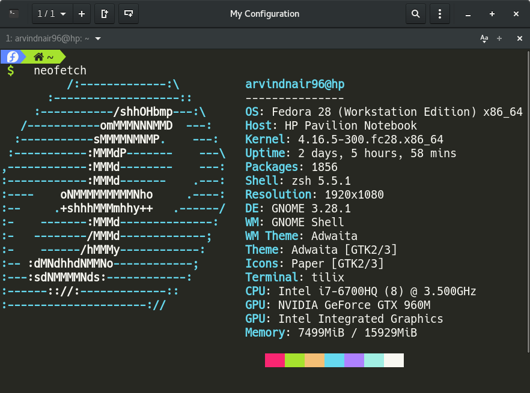

# Dotfiles [ZSH+POWERLEVEL9K+STOW]



## Welcome to my dofiles!

```
      _       _    __ _ _           
   __| | ___ | |_ / _(_) | ___  ___ 
  / _` |/ _ \| __| |_| | |/ _ \/ __|
 | (_| | (_) | |_|  _| | |  __/\__ \
  \__,_|\___/ \__|_| |_|_|\___||___/
  | |__  _   _                      
  | '_ \| | | |                     
  | |_) | |_| |                     
  |_.__/ \__, |    _           _    
   __ _ _|___/   _(_)_ __   __| |   
  / _` | '__\ \ / / | '_ \ / _` |   
 | (_| | |   \ V /| | | | | (_| |   
  \__,_|_|    \_/ |_|_| |_|\__,_|   
                                    
```

## contents

+ [installation and setup](#installation-and-setup)

## Installation and Setup

### Setup
Before proceeding you need to install **STOW** (a.k.a Gnu Stow) 
#### Ubuntu/Debian users
```
  sudo apt update
  sudo apt install stow
```
#### Fedora
```
  sudo dnf install stow stow-doc
```
#### Arch users
If you are on Arch linux add the community repo and install Stow
```
  # will be updated soon

```
### backup
This repository makes sure that backup of dotfiles is created which located at Backup directory in your home
> A Timestamp is appended to dotfiles folder in $home/backup So every run creates a new backup
> keeping the old ones intact 

```
cd ~/backup
```

### Installation
> Note: This is repo is tailered to my needs so, it is recommended that you fork this repo and make changes to  file according to your needs and requirements. 
> !! DONT RUN IT BLINDLY !!

If you are on Mac install XCODE CLI tools :
```
$ xcode-select --install
```
Clone the repo and run the software and voila !!

```
$ git clone https://github.com/ArvindNair001/dotfiles.git .dotfiles && cd .dotfiles
$ ./install.sh
```
