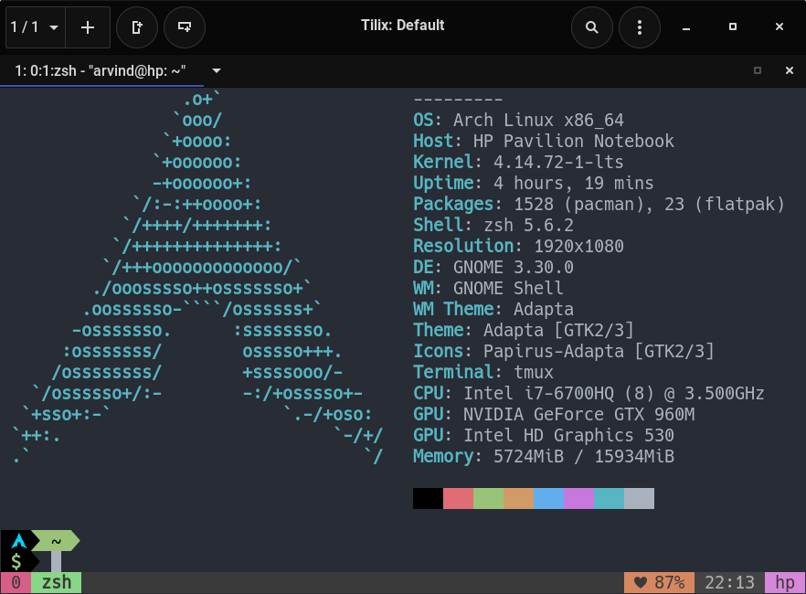

# Dotfiles [ZSH+POWERLEVEL9K+VIM+TMUX]

## Welcome to my dofiles!

```
      _       _    __ _ _           
   __| | ___ | |_ / _(_) | ___  ___ 
  / _` |/ _ \| __| |_| | |/ _ \/ __|
 | (_| | (_) | |_|  _| | |  __/\__ \
  \__,_|\___/ \__|_| |_|_|\___||___/
  | |__  _   _                      
  | '_ \| | | |                     
  | |_) | |_| |                     
  |_.__/ \__, |    _           _    
   __ _ _|___/   _(_)_ __   __| |   
  / _` | '__\ \ / / | '_ \ / _` |   
 | (_| | |   \ V /| | | | | (_| |   
  \__,_|_|    \_/ |_|_| |_|\__,_|   
                                    
```

## contents

+ [Screenshots](#screenshots)
+ [Installation and Setup](#installation-and-setup)
+ [Fonts](#fonts)
+ [Credits](#thanks-to...)
+ [Disclaimer]()

## Screenshots




## Installation and Setup

### Setup
Before proceeding you need to install **STOW** (a.k.a Gnu Stow) && **rsync**

#### Ubuntu/Debian users
```
  sudo apt update
  sudo apt install stow
```
#### Fedora
```
  sudo dnf install stow stow-doc
```
#### Arch users
If you are on Arch linux add the community repo and install Stow
```
  sudo pacman -S stow rsync
```
#### macOS users
If you are on Mac install XCODE CLI tools :
```
$ xcode-select --install
```

### backup
This repository backs up relevant dotfiles in your Home directory before deploying.
> It is recommended that you backup your dotfiles at a different location to be on
> the safe side 

```
rsync -aAX --no-links --stats ~/.[^.]* /path/of/destination
```

### Installation
> Note: This repo is tailered to my needs so, it is recommended that you fork this repo and make changes to according to your needs and requirements. 
> !! DONT RUN IT BLINDLY !!

Clone the repo and run the software and voila !!

```
$ git clone https://github.com/ArvindNair001/dotfiles.git .dotfiles && cd .dotfiles
$ ./install.sh
```

## Distro I Use
|||
| --- | --- |
| Distro | Arch Linux (<3 Absolute best !!) |
| Kernel | LTS |
| DE | Gnome |
| Aur helper | yay |
| Theme | Adapta |
| Icons | Papirus |

## Softwares I Use
|Personal| Apps |
|----|----|
| Browser  |  Firefox Nightly |
| Terminal Emulator  | Tilix (<3)
| Video Player|  GNOME MPV (<3) |
| Music Player   |  GPMDP |
| Messaging client  | Telegram  |
| Note Taking | Mark Text (Markdown Editior), Cherry Tree (for programming notes) |


| Development | Apps|
| ---- | ---- |
| Browser | Firefox Developer Edition, Chromium |
| Docsets | zeal |
| Text Editor | Vim, VSCode |
| Other Tools | Gitkraken (Moving to Fugitive) |


## Fonts I Use
|  Application |   Fonts|
|---|---|
|  Terminal font |  Hack Nerd Regular font |
|  Visual studio |  Fira code |
| Gnome interface  |   Roboto Regular|
| Cherry Tree    | Lato sans |


## Thanks to…

* Parth for his [tmux setup](https://github.com/Parth/dotfiles/blob/master/tmux/tmux.conf)
* [GabMus](https://www.youtube.com/user/gabrielemusco) for his [vim setup](https://github.com/GabMus/mydotfiles)
* msjche for his [vim setup and Keybindings](https://github.com/msjche/dotfiles_laptop/blob/master/.vimrc)
* [F-dotfiles](https://github.com/Kraymer/F-dotfiles) for the idea of using stow.
* [Nick Nisi](https://github.com/nicknisi) for his [dotfiles repo](https://github.com/nicknisi/dotfiles) ,and for inspiring me to create this repo.
* Alex [@babywogue](https://www.youtube.com/channel/UCZWadyLVO4ZnMgLrRVtS6VA) for his article on [powerlevel9k configuration](https://medium.com/@alex285/get-powerlevel9k-the-most-cool-linux-shell-ever-1c38516b0caa) and also for introducing me to [powerlevel9k](https://github.com/bhilburn/powerlevel9k).
* Ham Vocke for his article on [A Guide to Customizing your tmux.conf](https://www.hamvocke.com/blog/a-guide-to-customizing-your-tmux-conf/)
* [unofficial dotfiles guide](https://dotfiles.github.io/)
* [mathiasbynens](https://github.com/mathiasbynens/dotfiles) for the idea of splitting shellrc files into logical segments.
